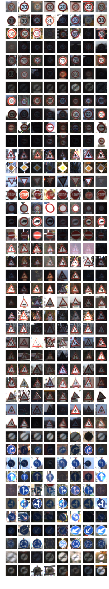
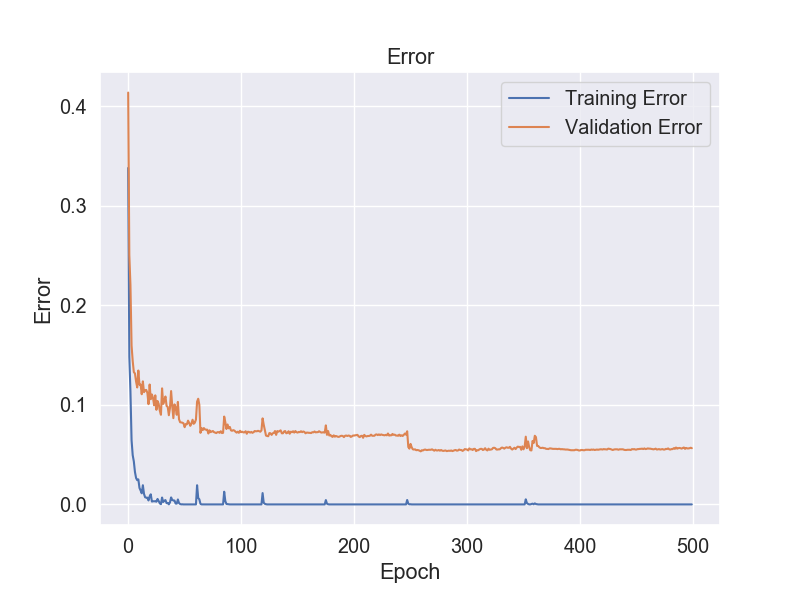
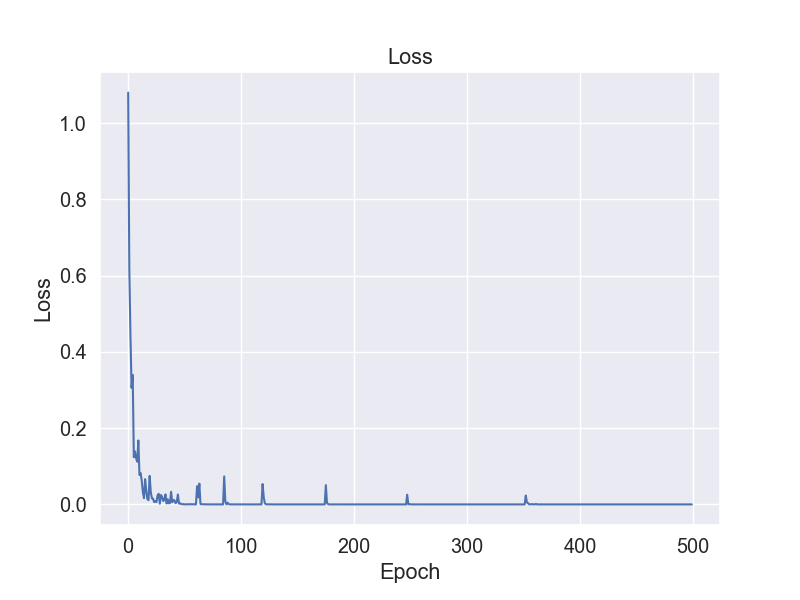

# Project-03: Build a Traffic Sign Recognition Program

## Overview 
In this project, a convolutional neural networks was built to classify traffic signs. [German Traffic Sign Dataset](http://benchmark.ini.rub.de/?section=gtsrb&subsection=dataset) was adopted to train and validate this model.

The goals / steps of this project are the following:
* Load the data set
* Explore, summarize and visualize the data set
* Design, train and test a model architecture
* Use the model to make predictions on new images
* Analyze the softmax probabilities of the new images
* Summarize the results

## Step 0: Load the Data Set
I used the pandas library to calculate summary statistics of the traffic
signs data set:

* The size of training set is 34799
* The size of the validation set is 4410
* The size of test set is 12630
* The shape of a traffic sign image is (31,31,3)
* The number of unique classes/labels in the data set is 43

## Step 1: Explore, Summarize and Visualize the Data Set
Here is an exploratory visualization of the data set. It is a bar chart showing how the traffic sign data distribued.

![training data][image1]

As can be seen from above image, the average number of training examples per class is 809, the minimum is 180 and the maximum 2010, hence some labels are one order of magnitude more abundant than others.

Most common signs:

- Speed limit (50km/h) train samples: 2010
- Speed limit (30km/h) train samples: 1980
- Yield train samples: 1920
- Priority road train samples: 1890
- Keep right train samples: 1860

Here is an visualization of some 8 randomly picked training examples for each class. As can be found, within each class there is a high variability in appearance due to different light conditions, time of the day and image angle.

## Step2: Design, train and test a model architecture
### Preprocessed the image data. 
As a first step, I decided to convert the images to grayscale because the first neural network I would like to try is LeNet, which takes the grayscale image as input. Here is an example of a traffic sign image before and after grayscaling.
![training img][image3]

As a last step, I normalized the image data dimensions so that they are of approximately the same scale.
center the data to have mean of zero, and normalize its scale to [-1, 1] along each feature

### Model architecture
In this project, the LeNet is introduced with slight modifications to fulfill the goals. The original architecture of LeNet is shown in following picture.
![LeNet][image4]

My final model adapted from LeNet consisted of the following layers:

| LAYER         		|     DESCRIPTION	        					| 
|:---------------------:|:---------------------------------------------:| 
| Input         		| 32x32x1 gray image   							| 
| Convolution 5x5     	| 1x1 stride, valid padding, outputs 32x32x64 	|
| RELU					|												|
| Max pooling	      	| 2x2 stride, valid padding, outputs 14x14x6    |
| Convolution 5x5	    | 1x1 stride, valid padding, outputs 10x10x16	|
| RELU					|												|
| Max pooling	      	| 2x2 stride, valid padding, outputs 5x5x16     |
| Fully connected		| inputs 400, outputs: 120                      |
| RELU					|												|
| Fully connected		| inputs 120, outputs: 84                       |
| RELU					|												|
| Fully connected		| inputs 84, outputs: 43                        |
 
### Train the model
To train the model, I tuned the epochs, batch_size and learning rate. Traning accuracy under different combinations of above parameters can be found in floowing table.

|DATE      |ACCURACY  |EPOCHS    |BATCH_SIZE|LEARNING RATE|TIME USAGE   |
|:---------|---------:|---------:|---------:|------------:|------------:|
|2019-12-7 |92.7%     |100       |128       |0.001        |223.922s     |
|2019-12-8 |92.4%     |100       |64        |0.001        |357.654s     |
|2019-12-8 |87.3%     |100       |128       |0.0001       |222.185s     |
|2019-12-8 |93.4%     |200       |128       |0.001        |449.605s     |
|2019-12-26|92.9%     |200       |512       |0.001        |186.725s     |
|2019-12-26|93.9%     |200       |256       |0.001        |244.398s     |
|2019-12-26|94.4%     |500       |256       |0.001        |588.761s     |

The parameters(`EPOCHS=500`, `BATCH_SIZE=256`, and `LEARNING RATE=0.001`) resulted in an accuracy of 93.4% on training set was finally selected. The error and loss of this model during the train porcess is shown in following pictures. 

Training error:

Training loss:

My final model results were:
* validation set accuracy of 0.944 
* test set accuracy of 0.931

## Step3: Use the model to make predictions on new images
Here are 20 German traffic signs(pre_processed to meet the input requirements of current model) that I found on the web:

![test][image7]

Here are the results of the prediction using my model:

|IMAGE       |GROUND TRUTH         |PREDICTION       |TRUE OR FAUSE   |
|:-----------|:--------------------|:----------------|:---------------|  
| 00000.ppm     | #16 Vehicles over 3.5 metric tons prohibited  |#16 Vehicles over 3.5 metric tons prohibited  | TRUE
| 00001.ppm     | #1 Speed limit (20km/h)                       |#1 Speed limit (20km/h)    | TRUE
| 00002.ppm     | #38 Keep right                                |#38 Keep right             | TRUE
| 00003.ppm     | #33 Turn right ahead                          |#33 Turn right ahead       | TRUE
| 00004.ppm     | #11 Right-of-way at the next intersection     |#11 Right-of-way at the next intersection| TRUE
| 00005.ppm     | #38 Keep right                                |#38 Keep right             | TRUE
| 00006.ppm     | #18 General caution                           |#18 General caution| TRUE
| 00007.ppm     | #12 Priority road                             |#12 Priority road| TRUE
| 00008.ppm     | #25 Road work                                 |#25 Road work| TRUE
| 00009.ppm     | #35 Ahead only                                |#35 Ahead only| TRUE
| 00010.ppm     | #12 Priority road                             |#12 Priority road| TRUE
| 00011.ppm     | #7 Speed limit (100km/h)                      |#7 Speed limit (100km/h)| TRUE
| 00012.ppm     | #23 Slippery road                             |#23 Slippery road     | TRUE
| 00013.ppm     | #7 Speed limit (100km/h)                      |#8 Speed limit (120km/h)					    	| FAUSE
| 00014.ppm     | #4 Speed limit (70km/h)                       |#4 Speed limit (70km/h)| TRUE
| 00015.ppm     | #9 No passing                                 |#9 No passing   | TRUE
| 00016.ppm     | #21 Double curve                              |#21 Double curve | TRUE
| 00017.ppm     | #20 Dangerous curve to the right              |#20 Dangerous curve to the right| TRUE
| 00018.ppm     | #27 Pedestrians                               |#27 Pedestrians| TRUE
| 00019.ppm     | #38 Keep right                                |#38 Keep right | TRUE

The model was able to correctly guess 19 of the 20 traffic signs, which gives an accuracy of 95%. This compares favorably to the accuracy on the test set of 93.1%.

## Step4: Analyze the softmax probabilities of the new images
To investigae how certain the model is when predicting on each of the 20 new images by looking at the softmax probabilities for each prediction. The top 5 softmax probabilities for each image along with the sign type of each probability are provided in following tables.

For most of these twenty images, the model is relatively sure about the prediction since the probability of the top one predicted sign is 1. As for `00012.ppm` and `00013.ppm`, the model is still certain about the predictions(with probabilities above 90%).

Top 5 predictions for image: 00000.ppm

|Label|Sign Name                                |Probability|
|:----|:--------------------------------------- |:---------|
|16   |Vehicles over 3.5 metric tons prohibited |1.000000000000 |
|0    |Speed limit (20km/h)                     |0.000000000000 |
|1    |Speed limit (30km/h)                     |0.000000000000 |
|2    |Speed limit (50km/h)                     |0.000000000000 |
|3    |Speed limit (60km/h)                     |0.000000000000 |

Top 5 predictions for image: 00001.ppm

|Label|Sign Name                                |Probability|
|:----|:--------------------------------------- |:---------|
|1    |Speed limit (30km/h)                     |1.000000000000 |
|5    |Speed limit (80km/h)                     |0.000000000000 |
|2    |Speed limit (50km/h)                     |0.000000000000 |
|0    |Speed limit (20km/h)                     |0.000000000000 |
|3    |Speed limit (60km/h)                     |0.000000000000 |

Top 5 predictions for image: 00002.ppm

|Label|Sign Name                                |Probability|
|:----|:--------------------------------------- |:---------|
|38   |Keep right                               |1.000000000000 |
|0    |Speed limit (20km/h)                     |0.000000000000 |
|1    |Speed limit (30km/h)                     |0.000000000000 |
|2    |Speed limit (50km/h)                     |0.000000000000 |
|3    |Speed limit (60km/h)                     |0.000000000000 |

Top 5 predictions for image: 00003.ppm

|Label|Sign Name                                |Probability|
|:----|:--------------------------------------- |:---------|
|33   |Turn right ahead                         |1.000000000000 |
|39   |Keep left                                |0.000000000000 |
|25   |Road work                                |0.000000000000 |
|37   |Go straight or left                      |0.000000000000 |
|0    |Speed limit (20km/h)                     |0.000000000000 |

Top 5 predictions for image: 00004.ppm

|Label|Sign Name                                |Probability|
|:----|:--------------------------------------- |:---------|
|11   |Right-of-way at the next intersection    |1.000000000000 |
|30   |Beware of ice/snow                       |0.000000000000 |
|6    |End of speed limit (80km/h)              |0.000000000000 |
|40   |Roundabout mandatory                     |0.000000000000 |
|21   |Double curve                             |0.000000000000 |

Top 5 predictions for image: 00005.ppm

|Label|Sign Name                                |Probability|
|:----|:--------------------------------------- |:---------|
|38   |Keep right                               |1.000000000000 |
|0    |Speed limit (20km/h)                     |0.000000000000 |
|1    |Speed limit (30km/h)                     |0.000000000000 |
|2    |Speed limit (50km/h)                     |0.000000000000 |
|3    |Speed limit (60km/h)                     |0.000000000000 |

Top 5 predictions for image: 00006.ppm

|Label|Sign Name                                |Probability|
|:----|:--------------------------------------- |:---------|
|18   |General caution                          |1.000000000000 |
|27   |Pedestrians                              |0.000000000000 |
|0    |Speed limit (20km/h)                     |0.000000000000 |
|1    |Speed limit (30km/h)                     |0.000000000000 |
|2    |Speed limit (50km/h)                     |0.000000000000 |

Top 5 predictions for image: 00007.ppm

|Label|Sign Name                                |Probability|
|:----|:--------------------------------------- |:---------|
|12   |Priority road                            |1.000000000000 |
|13   |Yield                                    |0.000000000000 |
|15   |No vehicles                              |0.000000000000 |
|40   |Roundabout mandatory                     |0.000000000000 |
|2    |Speed limit (50km/h)                     |0.000000000000 |

Top 5 predictions for image: 00008.ppm

|Label|Sign Name                                |Probability|
|:----|:--------------------------------------- |:---------|
|25   |Road work                                |1.000000000000 |
|0    |Speed limit (20km/h)                     |0.000000000000 |
|1    |Speed limit (30km/h)                     |0.000000000000 |
|2    |Speed limit (50km/h)                     |0.000000000000 |
|3    |Speed limit (60km/h)                     |0.000000000000 |

Top 5 predictions for image: 00009.ppm

|Label|Sign Name                                |Probability|
|:----|:--------------------------------------- |:---------|
|35   |Ahead only                               |1.000000000000 |
|0    |Speed limit (20km/h)                     |0.000000000000 |
|1    |Speed limit (30km/h)                     |0.000000000000 |
|2    |Speed limit (50km/h)                     |0.000000000000 |
|3    |Speed limit (60km/h)                     |0.000000000000| 

Top 5 predictions for image: 00010.ppm

|Label|Sign Name                                |Probability|
|:----|:--------------------------------------- |:---------|
|12   |Priority road                            |1.000000000000 |
|42   |End of no passing by vehicles over 3.5 metric tons |0.000000000000 |
|7    |Speed limit (100km/h)                    |0.000000000000 |
|5    |Speed limit (80km/h)                     |0.000000000000 |
|11   |Right-of-way at the next intersection    |0.000000000000| 

Top 5 predictions for image: 00011.ppm

|Label|Sign Name                                |Probability|
|:----|:--------------------------------------- |:---------|
|7    |Speed limit (100km/h)                    |1.000000000000 |
|8    |Speed limit (120km/h)                    |0.000000000000 |
|0    |Speed limit (20km/h)                     |0.000000000000 |
|1    |Speed limit (30km/h)                     |0.000000000000 |
|2    |Speed limit (50km/h)                     |0.000000000000 |

Top 5 predictions for image: 00012.ppm

|Label|Sign Name                                |Probability|
|:----|:--------------------------------------- |:---------|
|23   |Slippery road                            |0.999996900558 |
|19   |Dangerous curve to the left              |0.000003048889 |
|11   |Right-of-way at the next intersection    |0.000000000563 |
|30   |Beware of ice/snow                       |0.000000000174 |
|31   |Wild animals crossing                    |0.000000000132| 

Top 5 predictions for image: 00013.ppm

|Label|Sign Name                                |Probability|
|:----|:--------------------------------------- |:---------|
|8    |Speed limit (120km/h)                    |0.937708199024 |
|5    |Speed limit (80km/h)                     |0.052441451699 |
|32   |End of all speed and passing limits      |0.009815099649 |
|7    |Speed limit (100km/h)                    |0.000030021069 |
|16   |Vehicles over 3.5 metric tons prohibited |0.000002375284| 

Top 5 predictions for image: 00014.ppm

|Label|Sign Name                                |Probability|
|:----|:--------------------------------------- |:---------|
|4    |Speed limit (70km/h)                     |1.000000000000 |
|1    |Speed limit (30km/h)                     |0.000000000004 |
|5    |Speed limit (80km/h)                     |0.000000000000 |
|0    |Speed limit (20km/h)                     |0.000000000000 |
|2    |Speed limit (50km/h)                     |0.000000000000| 

Top 5 predictions for image: 00015.ppm

|Label|Sign Name                                |Probability|
|:----|:--------------------------------------- |:---------|
|9    |No passing                               |1.000000000000 |
|10   |No passing for vehicles over 3.5 metric tons |0.000000000000| 
|16   |Vehicles over 3.5 metric tons prohibited |0.000000000000 |
|3    |Speed limit (60km/h)                     |0.000000000000 |
|20   |Dangerous curve to the right             |0.000000000000| 

Top 5 predictions for image: 00016.ppm

|Label|Sign Name                                |Probability|
|:----|:--------------------------------------- |:---------|
|21   |Double curve                             |1.000000000000 |
|11   |Right-of-way at the next intersection    |0.000000000000 |
|31   |Wild animals crossing                    |0.000000000000 |
|39   |Keep left                                |0.000000000000 |
|25   |Road work                                |0.000000000000 |

Top 5 predictions for image: 00017.ppm

|Label|Sign Name                                |Probability|
|:----|:--------------------------------------- |:---------|
|20   |Dangerous curve to the right             |1.000000000000 |
|28   |Children crossing                        |0.000000000000 | 
|11   |Right-of-way at the next intersection    |0.000000000000 | 
|3    |Speed limit (60km/h)                     |0.000000000000 | 
|23   |Slippery road                            |0.000000000000 |

Top 5 predictions for image: 00018.ppm

|Label|Sign Name                                |Probability|
|:----|:--------------------------------------- |:---------|
|27   |Pedestrians                              |1.000000000000| 
|18   |General caution                          |0.000000000000 |
|11   |Right-of-way at the next intersection    |0.000000000000| 
|24   |Road narrows on the right                |0.000000000000| 
|28   |Children crossing                        |0.000000000000 |

Top 5 predictions for image: 00019.ppm

|Label|Sign Name                                |Probability|
|:----|:--------------------------------------- |:---------|
|38   |Keep right                               |1.000000000000 |
|0    |Speed limit (20km/h)                     |0.000000000000 |
|1    |Speed limit (30km/h)                     |0.000000000000 |
|2    |Speed limit (50km/h)                     |0.000000000000 |
|3    |Speed limit (60km/h)                     |0.000000000000 |

## Step5: Summarize the results
In this project, the original LeNet was modified to recognize traffic signs. With tuning the traing parameters, a considerable validation accuracy of 0.944 was finally achieved when the bacth sets, epochs, and learning rate were set as 256, 500, and 0.001, respectively. The accuracy of this model on test set is 0.931. Using this model, we predicted 20 extra traffic sing images from [German Traffic Sign Benchmarks Dataset](http://www.baidu.com/link?url=_LMFNS6UTiMI-sz2fH63yhMyaTiegVwVq5N6XWqiNmbej2FGYUnOnrwrjZOXY078&wd=&eqid=f239d477000967ad000000035e048a01). The model was able to correctly guess 19 of the 20 traffic signs, which gives an accuracy of 95%.

## Step6: (Optional) Visualizing the Neural Network (See Step 4 of the Ipython notebook for more details)
`Convolution layer 1`
![test][image8]

`RELU 1`
![test][image9]

`Max pooling 1`
![test][image10]

`Convolution layer 2`
![test][image11]

`RELU 2`
![test][image12]

`Max pooling 2`
![test][image13]

## Discussion 
The approach adopted in current pipeline worked pretty well. However, there are still room for improment on this project. Following aspects can be taken into consideration in near future:
- As stated before, only grayscaled image features were considered in current approach. All three color channels of the input image can be taken into consideration to further improve the accuracy of the model.
- The impact of input resolution should be studied to improve both accuracy and processing speed.

[//]: # (Image References)
[image1]: ./img/training_set_counts.png "Visualization"
[image2]: ./img/random_examples.png "Visualization_imgs"
[image3]: ./img/gray_scale.png "Grayscale"
[image4]: ./img/lenet.png "LeNet"
[image5]: ./img/learning_curve_error.png 
[image6]: ./img/learning_curve_loss.png 
[image7]: ./img/test_examples.png 
[image8]: ./img/Conv2D_0.png 
[image9]: ./img/Relu_0.png 
[image10]: ./img/MaxPool_0.png 
[image11]: ./img/Conv2D_1.png 
[image12]: ./img/Relu_1.png 
[image13]: ./img/MaxPool_1.png 